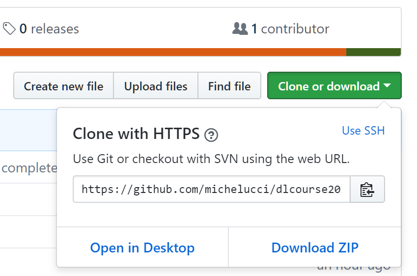

# github repository for "Neural Networks and Deep Learning for Life Sciences and Health Applications" ZHAW course

(C) 2018 Umberto Michelucci

This github repository contains the course material for the course 

**Neural Networks and Deep Learning for Life Sciences and Health Applications,
An introductory course about theoretical fundamentals, case studies 
and implementations in python and tensorflow**

given in the Autumn Semester 2018 at the ZHAW (University of Zürich for applied science).

# What to do before the course start

Before the course start plese do the following:

1. Get the PDF for the book under the folder ```book``` and follow Chapter 1 to install your environment. It is important that on the first day of the course you have a laptop on which you can run jupyter notebooks with tensorflow installed. In case you have issues please don't hesitate to contact me. We will try to sort out your issues before the course begin.

# References

In case you want to get some exposure to Python I can  suggest the following book

https://jakevdp.github.io/PythonDataScienceHandbook/ 


# Welcome Email copy (REFERENCE)

Hallo Everyone, 
and a very "deep" welcome (pun intended) ;-)

I am really excited for next week, and I am really itching to get started. I hope you are too! I would like to make sure that on the first day you all have a laptop (you will need one), where you can run Jupyter notebooks. If you don't know what they are don't worry. Everything is explained on my book. 
This brings us to the next question: how to get it? A PDF version (complete with links, colored images and much more) is available on the github repository for the course. The repository is not public, so I will need to add you. 

Please do the following

1. Send me your github account name. If you don't have one, please create one at this address https://github.com/join. It should be pretty easy. As soon as you have an account send me your username.
2. I will add your user to the repository, and you will get an email telling you where to find it. For your reference the repository is here: https://github.com/michelucci/dlcourse2018_students
3. Download the repository on your computer as a zip file, or even better use the client "github desktop" to keep your local copy synchronized with the online one. To know how to do that, check the guide https://help.github.com/desktop/guides/getting-started-with-github-desktop/ 

How to download the repository as a zip file
- First click on the link (when you have access) https://github.com/michelucci/dlcourse2018_students
- Then click on the green button "Clone or download" and select "Download ZIP"



3. In the repository you will find a folder called "book" where you will find the PDF of the book for you (is customized for you in the course, check if you found how ;-)). Take it and read how to prepare your development environment in Chapter 1 (ignore the computational graphs, we will look at them together)
4. In case you want to get some exposure to Python, in the README file in the repository I put a reference to a book available online that will give you the necessary basics (and much more). But we will look at them together, so don't worry too much.

You will notice that in the repository only folders for Week 1 and 2 are present. That is not a mistake. I will continuously add, as times goes by, the other weeks. I will tailor them according to what your needs will be. Every weekend before each lecture I will publish the material for you to download and will inform you by mail.

Don't worry too much about all the new things that you may see here, like Python, github and so on. We will look at them together at the beginning of the course.

Remember: 
send me your github username 
try to get your environment installed (following the first part of Chapter 1 in my book)
download locally the repository (we will need the files in week 1 on the first day)

In case you have issues or questions, don't hesitate to contact me any time.

Looking forward to working with you!

See you next week, 
